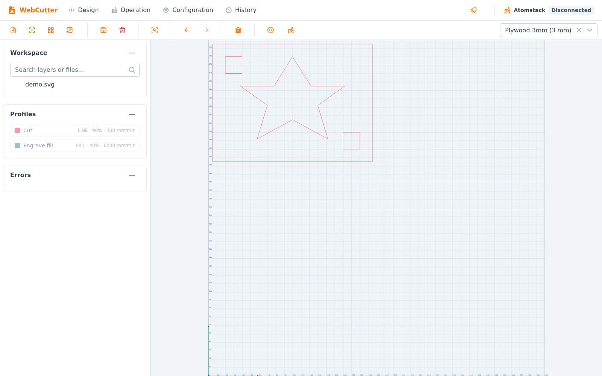
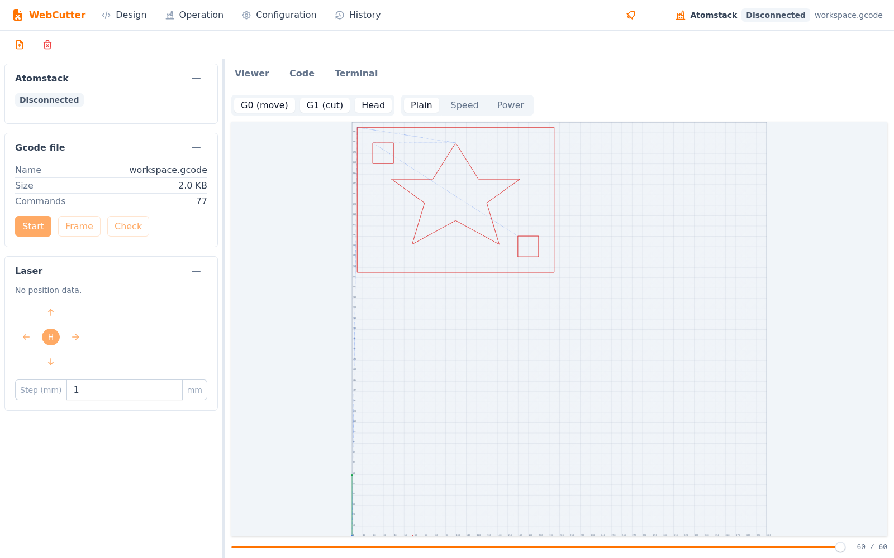
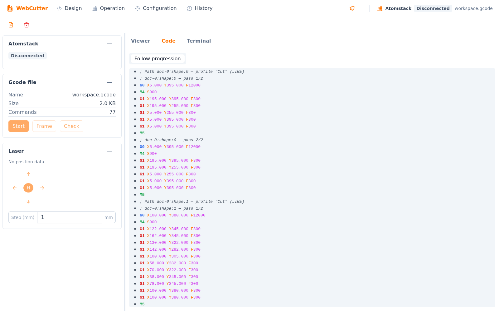
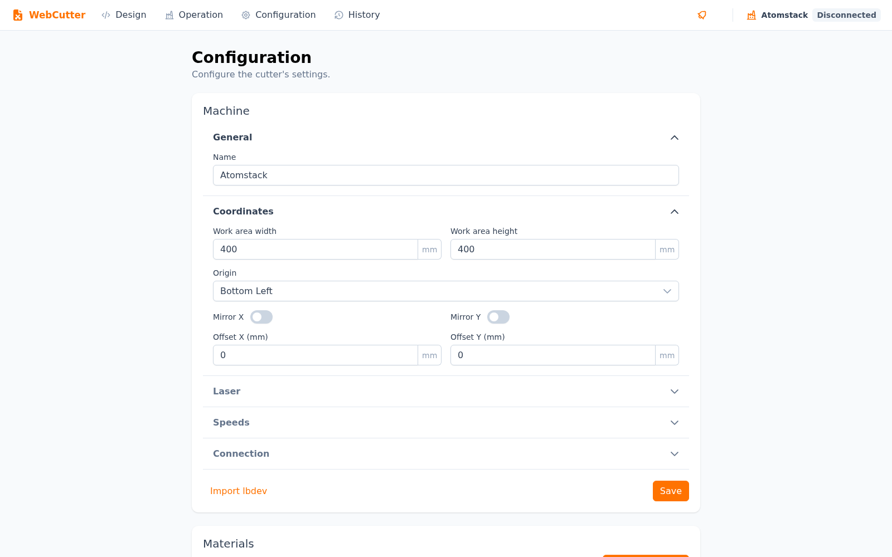
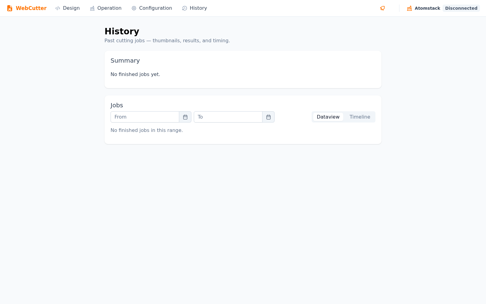

# WebCutter

A local web application to drive an **Atomstack laser cutter** (GRBL 1.1 firmware) over
USB — the equivalent of [OctoPrint](https://octoprint.org/), but for a laser cutter
instead of a 3D printer.

It imports an SVG design, lets you assign material/power/speed profiles per shape,
generates the resulting G-code, streams it to the machine over serial, and tracks the
job in real time — position, GRBL status, a live terminal, and job history — all from
the browser.



## Features

- **SVG → G-code**: multi-document import, layer/group tree, shape selection, move,
  rotate, laser kerf offset, and a "test pattern" generator for calibrating a new
  material.
- **Material presets**: a library of materials, each with several LINE (cut) or FILL
  (engrave) profiles — power %, speed, passes, hatch spacing — assigned to shapes by
  drag-click.
- **Operation console**: connect to the cutter, jog the head, start/pause/resume/abort
  a job, preview the toolpath, and watch the raw serial traffic in a terminal.
- **Job history**: thumbnails, results (success/error/aborted), and timing for past runs.

<table>
<tr>
<td></td>
<td></td>
</tr>
<tr>
<td></td>
<td></td>
</tr>
</table>

## Tech stack

- **Monorepo**: [Nx](https://nx.dev/)
- **Backend**: [NestJS](https://nestjs.com/)
- **Frontend**: [Angular](https://angular.dev/) + Optimus UI
- **Serial communication**: [`serialport`](https://serialport.io/) (Node's equivalent
  of `pyserial`)
- **Storage**: SQLite via [TypeORM](https://typeorm.io/) — nothing more is needed for a
  local, single-user app
- **Real-time**: WebSocket via `@nestjs/websockets` (the raw `ws` library), broadcasting
  GRBL status and raw serial traffic to the UI

## Deployment constraints

This is meant to run **locally, for a single user, on a machine with the cutter
physically plugged in**:

- No authentication, no multi-user management.
- Not meant to be exposed on the network beyond the local machine/LAN.
- Physical safety (overheating cutoff, door sensor) is handled by the machine itself; the
  software adds its own alarm lock on top so a silent GRBL reset can never be mistaken
  for "safe to resume" — see `CLAUDE.md` for the full detail if you're touching that code.

## How to develop

The dev environment is a [devcontainer](.devcontainer/devcontainer.json) (VS Code +
Dev Containers extension) with Node preinstalled, so no local Node/npm install is
needed on your machine — just Docker and the extension.

1. Open the folder in VS Code and choose **Dev Containers: Rebuild and Reopen in
   Container**.
2. Dependencies install automatically (`npm ci`) as part of the container setup.
3. Run both apps:

   ```bash
   npm run serve
   ```

   This starts the backend (NestJS, `:3000`) and the frontend (Angular dev server,
   `:4200`, proxying `/api` to the backend). Open `http://localhost:4200`.

Useful commands (always through `nx`, prefixed with `npx` if the CLI isn't installed
globally):

```bash
npx nx serve backend       # backend only
npx nx serve frontend      # frontend only
npx nx test backend        # unit tests
npx nx lint frontend       # lint a single project
npx nx run-many -t lint test build   # everything, across all projects
```

By default, the backend never opens the serial port on its own — see
`ALLOW_PHYSICAL_CONNECTION` below. A real dev session against the physical cutter sets
that variable itself; a plain `nx serve backend` is always safe to run even with the
machine plugged into the container.

### Environment variables (backend)

| Variable | Purpose |
| --- | --- |
| `PORT` | HTTP/WebSocket port (default `3000`) |
| `DATABASE_PATH` | SQLite file path (default `dev.db`) |
| `ALLOW_PHYSICAL_CONNECTION` | Set to `true` to let the backend auto-connect to the configured serial port. Leave unset for any dev/test run where a real machine could be plugged in. |

## How to deploy

Production runs on a small always-on box (e.g. a Proxmox LXC container with USB
passthrough for the cutter) — no Docker/Podman needed. The topology:

```
Browser ──▶ Caddy (:80) ──┬──▶ static files (Angular build)
                           └──▶ reverse proxy /api/* ──▶ NestJS backend (:3000, systemd)
```

Everything needed to stand this up lives in [`deploy/`](deploy/):

- [`deploy/Caddyfile`](deploy/Caddyfile) — serves the Angular build and reverse-proxies
  `/api/*` (REST + WebSocket) to the backend.
- [`deploy/webcutter-backend.service`](deploy/webcutter-backend.service) — systemd unit
  running the built backend as the `webcutter` user, with `dialout` group access to the
  USB serial device.
- [`deploy/deploy.sh`](deploy/deploy.sh) — pulls the latest backend/frontend build
  artifacts and installs them. **No `npm ci`/`nx build` runs on the production box** —
  see below.

### Build artifacts

[`.github/workflows/release.yml`](.github/workflows/release.yml) builds the backend and
frontend on every push to `main` and publishes them as tarballs on a new GitHub
Release. `deploy/deploy.sh` downloads the latest release (via `gh release download`),
extracts it, runs `npm ci --omit=dev` only inside the pruned backend folder (installs
the `serialport`/`sqlite3` native bindings for that machine), and restarts the
service.

### One-time server setup

1. Install Node (matching the version the workflow builds with), the
   [GitHub CLI](https://cli.github.com/) (`gh auth login`, needs read access to this
   repo), and [Caddy](https://caddyserver.com/docs/install).
2. Create a `webcutter` system user, in the `dialout` group, owning `/opt/webcutter`.
3. Copy `deploy/Caddyfile` to `/etc/caddy/Caddyfile` and
   `deploy/webcutter-backend.service` to `/etc/systemd/system/`, then:

   ```bash
   sudo systemctl daemon-reload
   sudo systemctl enable --now caddy webcutter-backend
   ```

4. From then on, deploying a new build is just:

   ```bash
   ./deploy/deploy.sh
   ```
